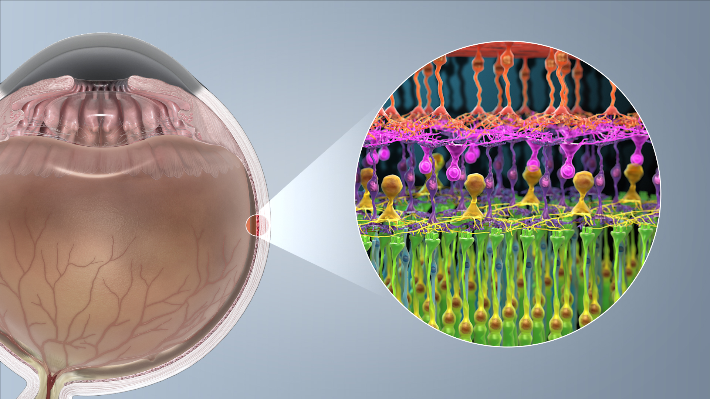
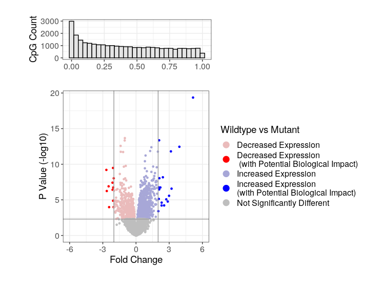
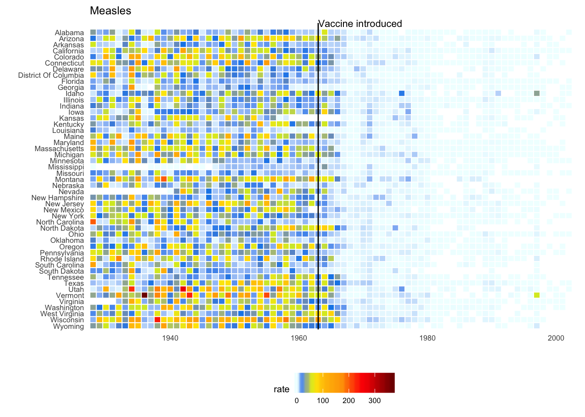
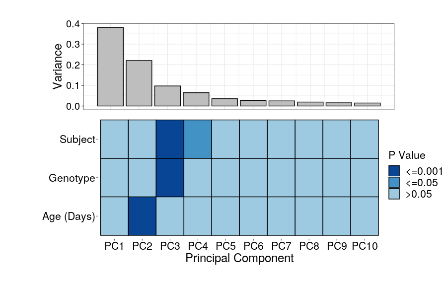
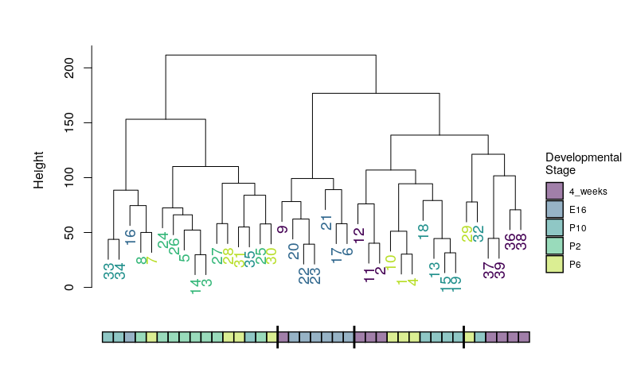

# EIPP Data Visualization Group Project

Plotting and data visualization is key to conveying the point of your results, but it often gets overlooked as a trivial task. In this project we will demonstrate the power of a good plot! It will discuss the main principles to consider when designing a plot, work through several examples (both basic and complex), and have a plot workshop session. At the end of the workshop you will be able to create a plot or two you can use in your own work. We will use R and ggplot (no experience required) to make presentation/publication-ready plots.

## Project Outline

#### Day 1
- Get everyone set up with a functional version of RStudio (with necessary packages) and data
- [Overview of visualization principles](https://docs.google.com/presentation/d/1dXF6E4tcLM1--YnmRgFB2DA9HN9wXpaxVvRMMOuquPQ/edit?usp=sharing)
- Introduction to ggplot
    - [ggplot_intro.R](https://github.com/redgar598/eipp_data_viz/blob/master/ggplot_intro.R)
    - Skip to extended ggplot if farmilliar with basics already
        - [ggplot_extended.R](https://github.com/redgar598/eipp_data_viz/blob/master/ggplot_extended.R)
- Discuss individual data visualization needs
    - Each person explains their project and data structure
    - Sketch plots of data you would like to implement

#### Day 2
- Demostrate the use of:
    - Sourcing
        - [Heat_scree_plot_generic.R](https://github.com/redgar598/eipp_data_viz/blob/master/Heat_scree_plot_generic.R)
        - [volcano.R](https://github.com/redgar598/eipp_data_viz/blob/master/volcano.R)
    - Custom Themes
        - [pretty_plots.R](https://github.com/redgar598/eipp_data_viz/blob/master/pretty_plots.R)
- One-on-one discussions on implementing plots discussed yesterday
    - We can also stay in the larger group to learn from each other, or welcome to work independently in implementing your plots
- After lunch meet to prepare presentation (5-8 min to present)


## RStudio Setup
Three options to get a functional RStudio with example data and necessary packages:

| Option                | Pro                                        | Con                                                                         |
|-----------------------|--------------------------------------------|-----------------------------------------------------------------------------|
| Virtual Machine (VM)  | Easy, already set up for you               | Won't have this resource once at home and you can not work on your own data |
| RStudio Local Install | Will be set to do further analysis at home | More difficult                                                              |
| RStudio Cloud         | Easy and can continue to use at home       | Slow and should not upload your real data                                   |

<br/>

1. **Use the virtual machine  (VM)**
    - This contains all installed packages and data for you 
    - When on VM run
    
```
#open terminal and run these two lines
conda activate eipp_data_viz
rstudio
#in the files panel click the eipp_data_viz folder
#click on eipp_data_viz.Rproj
# Open the ggplot_intro.R script
```
<br/>

2. **Install RStudio and necessary packages locally**
    - First download [R](https://cran.r-project.org/) and then [R Studio](https://www.rstudio.com/products/rstudio/download/#download) to your local machine 
    - Then to get the data
        - *If you have git installed*, then in RStudio: Start a new project (file>new project), select Version Control, then git
            - Paste the repository url https://github.com/redgar598/eipp_data_viz.git
            - Once this has cloned load eipp_data_viz.Rproj
        - *Without git download* git repo as zip: [here](https://github.com/redgar598/eipp_data_viz) then hit "Clone or download"
            - Then within RStudio navigate to the folder and load eipp_data_viz.Rproj
    
    - Then after cloning from git or downloading the zip you need a few packages installed
    
```
# These are essential
install.packages("ggplot2")
install.packages("reshape2")
install.packages("gridExtra")


# These are fun and useful
install.packages("RColorBrewer")
install.packages("scales")
install.packages("rafalib")
install.packages("dplyr")
```
<br/>

3. **Rstudio session in the [cloud](https://rstudio.cloud/) is another option but will only be a back up**
    - Similar process to installing locally and I will help you through it if anyone needs this option

<br/><br/>


### R Projects
What even is "eipp_data_viz.Rproj" and why do you keep saying to load it? A complete explination is [here](https://www.tidyverse.org/articles/2017/12/workflow-vs-script/). But a project file is a quick and contained way to load the required paths to the data, and related scripts whereever they happen to be on your computer. What we are doing for this tutorial is a great example. Since many of you will work locally, the scripts for eipp_data_viz should run within the eipp_data_viz folder on your computer without having to specify exactly where on your computer you saved it. R Projects are a system to help with data reproducibility when using R.

<br/><br/>

## Data We Will Be Using for ggplot Introduction
We will be looking at gene expression data from mouse photoreceptors. There are samples from different developmental stages (E16,P2,P6,P10 and 4 weeks) and two mouse lines, a wildtype (wt) and knockouts for rod cell specific transcription factor (NrlKO). The gene expression and sample information data were collected from the Gene Expression Omnibus (GEO), under study ID [GSE4051](https://www.ncbi.nlm.nih.gov/geo/query/acc.cgi?acc=GSE4051).

For more information on the actual paper see the associated [publication](http://www.pnas.org/cgi/pmidlookup?view=long&pmid=16505381).

<p align="left">
  
    <figcaption> <sup>www.scientificanimations.com [<a href="https://creativecommons.org/licenses/by-sa/4.0">CC BY-SA 4.0</a>], <a href="https://commons.wikimedia.org/wiki/File:Photoreceptor_cell.jpg">via Wikimedia Commons</a></sup></figcaption>
</p>


___


<br/><br/>

## Extended ggplot
Below are several examples of complex plots. Feel free to work through them on your own to see some techniques for developing presentation ready plots. 

### Example 1
We will start with a volcano plot I have made myself. 

<p align="left">
  
</p>


### Example 2
This example is take from the [simply statistics blog](https://simplystatistics.org/2019/08/28/you-can-replicate-almost-any-plot-with-ggplot2/). 

<p align="left">
  
</p>


### Example 3

Principal Components Analysis (PCA) was done on gene expression data. The output is saved in 'gene_expression_PCA_data.RData' Loadings are the PCA loadings for each sample which can then be associated with sample information. Importance is the variance explained by each PC. I have used and ANOVA or correlations to generate the association P values of each PC and the sample information available. 

<p align="left">
  
</p>


### Example 4
The following example is for patient mutation data in relation of clinical factors. The provided code (taken from [stack overflow](https://stackoverflow.com/questions/34211735/r-how-to-allocate-screen-space-to-complex-ggplot-images)) generates data to make the plot. 

<p align="left">
  
</p>


### Example 5
The following example is for visualizing clustering data with color. The provided code loads data and does the clustering to generate the dendogram. I recommend *myplclust* from the rafalib package for coloring the clustering labels by developmental stage.

<p align="left">
  
</p>


<br/>
<br/>

### Additional Resources
[Effective Visual Communication for the Quantitative Scientist](https://ascpt.onlinelibrary.wiley.com/doi/full/10.1002/psp4.12455)
<br/>
[ggplot cheat sheet](https://www.rstudio.com/wp-content/uploads/2015/03/ggplot2-cheatsheet.pdf)
<br/>
[Points of View columns on data visualization](http://blogs.nature.com/methagora/2013/07/data-visualization-points-of-view.html)


# Things we found
```
theme(
  panel.background = element_rect(fill = "#BFD5E3", colour = "#6D9EC1",
                                size = 2, linetype = "solid"),
  panel.grid.major = element_line(size = 0.5, linetype = 'solid',
                                colour = "white"), 
  panel.grid.minor = element_line(size = 0.25, linetype = 'solid',
                                colour = "white"))
 ```


```
install.packages("devtools") 
library(devtools)
devtools::install_github("dgrtwo/gganimate")
```
