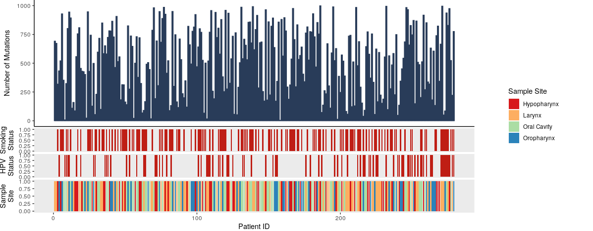

# EIPP Data Visualization Group Project
Code for introduction to data visualization for the EIPP 2nd year course

Contact

## Overview
Plotting and data visualization is key to conveying the point of your results, but it often gets overlooked as a trivial task. In this project we will demonstrate the power of a good plot! It will discuss the main principles to consider when designing a plot, work through several examples (both basic and complex), and have a plot workshop session. At the end of the workshop you will be able to create a plot or two you can use in your own work. We will use R and ggplot (no experience required) to make presentation/publication-ready plots.

#### Data We Will Be Using for Introduction
We will be looking at gene expression data from mouse photoreceptors. There are samples from different developmental stages (E16,P2,P6,P10 and 4 weeks) and two mouse lines, a wildtype (wt) and knockouts for rod cell specific transcription factor (NrlKO). The gene expression and sample information data were collected from the Gene Expression Omnibus (GEO), under study ID [GSE4051](https://www.ncbi.nlm.nih.gov/geo/query/acc.cgi?acc=GSE4051).

For more information on the actual paper see the associated [publication](http://www.pnas.org/cgi/pmidlookup?view=long&pmid=16505381).

  
    <figcaption> www.scientificanimations.com [<a href="https://creativecommons.org/licenses/by-sa/4.0">CC BY-SA 4.0</a>], <a href="https://commons.wikimedia.org/wiki/File:Photoreceptor_cell.jpg">via Wikimedia Commons</a></figcaption>

___

  

# EIPP Data Visualization Extended Examples
Below are several examples of complex plots. Feel free to work through them on your own to see some techniques for developing presentation ready plots. 

### Example 1
We will start with a volcano plot I have made myself. 

  

### Example 2
This example is take from the [simply statistics blog](https://simplystatistics.org/2019/08/28/you-can-replicate-almost-any-plot-with-ggplot2/). 

  

### Example 3

Principal Components Analysis (PCA) was done on gene expression data. The output is saved in 'gene_expression_PCA_data.RData' Loadings are the PCA loadings for each sample which can then be associated with sample information. Importance is the variance explained by each PC. I have used and ANOVA or correlations to generate the association P values of each PC and the sample information available. 

  

### Example 4
The following example is for patient mutation data in relation of clinical factors. The provided code (taken from [stack overflow](https://stackoverflow.com/questions/34211735/r-how-to-allocate-screen-space-to-complex-ggplot-images)) generates data to make the plot. 

  

### Example 5
The following example is for visualizing clustering data with color. The provided code loads data and does the clustering to generate the dendogram. I recommend *myplclust* from the rafalib package for coloring the clustering labels by developmental stage.

  

 
 

### Additional Resources
[Effective Visual Communication for the Quantitative Scientist](https://ascpt.onlinelibrary.wiley.com/doi/full/10.1002/psp4.12455)
 
[ggplot cheat sheet](https://www.rstudio.com/wp-content/uploads/2015/03/ggplot2-cheatsheet.pdf)
 
[Points of View columns on data visualization](http://blogs.nature.com/methagora/2013/07/data-visualization-points-of-view.html)
